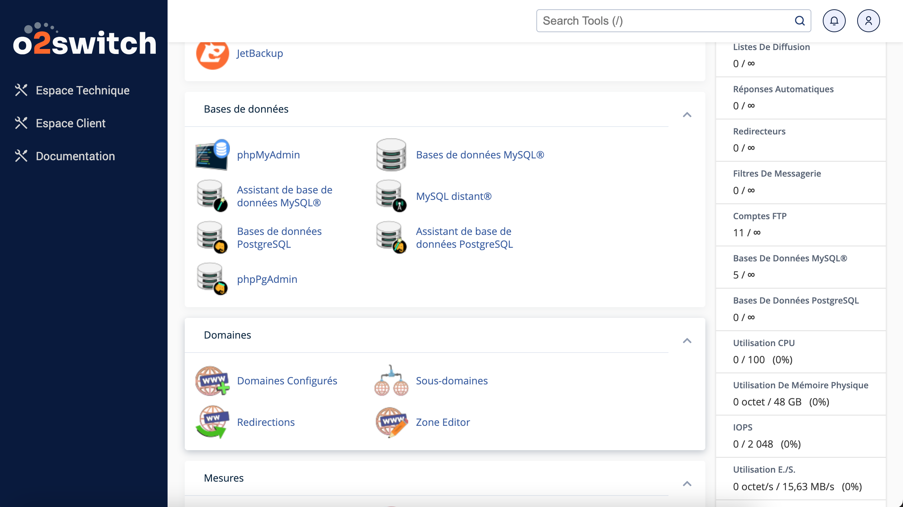

# Documentation du Déploiement de l'Application "Devis" avec CodeIgniter 4 et O2Switch

## 1. Introduction

Cette documentation détaille le processus de déploiement de l'application web "Devis" développée avec CodeIgniter 4. Elle vise à fournir des instructions claires et précises pour déployer avec succès l'application sur un serveur web.Ici nous allons déployer l'application sur O2Switch.

## 2. Prérequis

Avant de commencer le déploiement de l'application "Devis", assurez-vous de disposer des éléments suivants :

- Un compte hébergement sur O2Switch.
- Un serveur web configuré et fonctionnel sur O2Switch.
- Un environnement PHP (version 7.4 ou supérieure) installé et opérationnel sur O2Switch. ici nous allons utiliser la version 8.2.0.
- Une base de données MySQL ou MariaDB configurée et accessible sur O2Switch.ici nous allons utiliser MySQL.
- Les fichiers de l'application "Devis" prêts à être déployés.

## 3. Installation & Configuration

### 3.1. Installation des Prérequis

Avant de déployer l'application, assurez-vous d'installer Composer, PHP et toutes les dépendances requises par CodeIgniter 4. Référez-vous au fichier README.md pour les instructions spécifiques.

### 3.2. Configuration de PHP sur O2Switch

Connectez-vous à votre compte O2Switch et accédez à la section de configuration PHP. Assurez-vous que la version de PHP est compatible avec CodeIgniter 4 (7.4 ou supérieure).

### 3.3. Configuration de la Base de Données sur O2Switch

Créez une nouvelle base de données MySQL ou MariaDB sur O2Switch et notez les informations de connexion (nom de la base de données, nom d'utilisateur, mot de passe).

Si vous avez déjà une base de données locale pour votre application CodeIgniter et que vous souhaitez la transférer vers votre hébergement O2Switch, vous pouvez suivre ces étapes :

**Exportez votre base de données locale :**

- Connectez-vous à phpMyAdmin ou utilisez une commande SQL pour exporter votre base de données locale sous forme de fichier SQL.

**Importez la base de données sur O2Switch:**

- Connectez-vous à phpMyAdmin sur votre hébergement O2Switch.
- Créez une nouvelle base de données avec le même nom que votre base de données locale.
- Sélectionnez l'option pour importer un fichier SQL.
- Cliquez sur le nom de votre base de données pour importer les tables dans la bonne base de données.
- Choisissez le fichier SQL exporté depuis votre base de données locale.
- Suivez les instructions pour importer le fichier SQL dans votre base de données sur O2Switch.

### 3.4. Configuration de l'Environnement

renommer le fichier `.env.example` en `.env` et configurez-le avec les informations spécifiques à votre environnement, notamment l'URL de base et les paramètres de la base de données.
Assurez-vous de changer la valeur de CI_ENVIRONMENT en production.

**Si votre fichier .env était déjà existant, vous pouvez le modifier directement.**

- Dans votre fichier .env ou dans le fichier de configuration de la base de données de votre application, mettez à jour les informations de connexion à la base de données pour refléter les paramètres de la base de données sur O2Switch.

En suivant ces étapes, vous pourrez utiliser la même base de données que celle que vous utilisez localement pour votre application CodeIgniter sur votre hébergement O2Switch. Cela vous évitera de recréer la structure de la base de données et de réinsérer les données manuellement.

**Il faut creer un utilisateur sur cette base de donnée avec tous les droits ( moi )
Puis lier cet utilisateur a la base de données.**

## 4. Déploiement

### 4.1. Transfert des Fichiers

Transférez les fichiers de l'application "Devis" vers le répertoire de votre site web sur O2Switch à l'aide d'un client FTP ou d'un gestionnaire de fichiers.
Ici nous allons utiliser FileZilla.

- Ouvrez un client FTP sur votre ordinateur. Si vous n'en avez pas, vous pouvez télécharger des clients FTP gratuits comme FileZilla.

- Dans les paramètres de connexion de votre client FTP, entrez les informations d'identification FTP fournies par O2Switch, notamment l'adresse du serveur FTP, votre nom d'utilisateur FTP et votre mot de passe FTP.(founit par O2Switch, vous les trouverez dans votre espace client)

- Une fois connecté, vous devriez voir les répertoires et fichiers sur votre serveur O2Switch.

- transférez tout le dossier de votre application CodeIgniter, y compris tous les fichiers et dossiers qu'il contient, vers votre serveur O2Switch via FileZilla. Cela permettra à votre application d'être accessible sur votre hébergement une fois le transfert terminé. Assurez-vous de transférer tous les fichiers nécessaires pour que votre application fonctionne correctement. Une fois le transfert terminé, nous pourrons passer à la configuration de votre environnement PHP et de votre base de données sur O2Switch.

### 4.2. Permissions des fichiers

Définissez les permissions correctes pour les fichiers et répertoires de l'application, en vous assurant que le serveur web peut lire et écrire les fichiers nécessaires.

### 4.3. Configuration du Serveur Web

Configurez le serveur web pour pointer vers le répertoire public de l'application "Devis" afin d'assurer son accessibilité via l'URL du serveur.

Pour configurer PHP sur votre hébergement O2Switch, vous devrez généralement accéder aux paramètres PHP de votre compte. Cela peut se faire via le panneau de contrôle de votre hébergement ou via une interface dédiée fournie par O2Switch.
Voici les étapes générales que vous devrez suivre pour configurer PHP :

- Accédez aux paramètres PHP de votre compte sur O2Switch.
- Vérifiez que la version de PHP est compatible avec les exigences de votre application CodeIgniter 4 (7.4 ou supérieure).
- Assurez-vous que les extensions PHP requises par CodeIgniter 4 sont activées. Cela peut inclure les extensions intl, mbstring, json, et mysqlnd.
- Configurez d'autres paramètres PHP selon les recommandations de CodeIgniter 4, comme la gestion des erreurs, les limites de mémoire et d'exécution, etc.
Une fois que vous avez configuré PHP avec succès, vous pouvez procéder à la configuration de votre application CodeIgniter en modifiant le fichier .env pour refléter les paramètres de votre environnement de production.

**CONFIGURER L'URL DANS CONFIG APP BASE URL http://sophie-lambert.sc3enun8721.universe.wf/**

### 4.4. Vérification du Déploiement

Vérifiez le déploiement en accédant à l'application via l'URL du serveur web. Assurez-vous que l'application se charge correctement et que toutes les fonctionnalités principales sont opérationnelles.

- Ouvrez un navigateur web et accédez à l'URL de votre application CodeIgniter sur O2Switch.
- Vous devriez voir la page d'accueil de l'application "Devis" s'afficher correctement, indiquant que l'application a été déployée avec succès.

- Si vous rencontrez des erreurs ou des problèmes lors de l'accès à l'application, vérifiez les journaux d'erreurs du serveur pour identifier les problèmes potentiels.

## 5. Tests Post-Déploiement

Effectuez les tests post-déploiement suivants pour garantir le bon fonctionnement de l'application :

- Testez les fonctionnalités principales de l'application, telles que la création de devis et la gestion des utilisateurs.
- Vérifiez les journaux d'erreurs du serveur pour détecter d'éventuels problèmes.
- Assurez-vous que l'application est accessible sur différents navigateurs et ordinateurs/tablettes.

## 6. Conclusion

En suivant les étapes décrites dans cette documentation, vous devriez être en mesure de déployer avec succès l'application "Devis" sur votre serveur web. Pour toute question ou assistance supplémentaire, n'hésitez pas à consulter la documentation officielle de CodeIgniter 4 ou à contacter SOPHIE LAMBERT.

